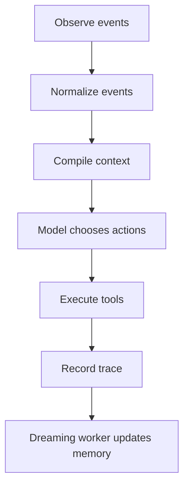

# Masterdoc: AI-Native Persona Chatbot Harness

## Document Status

This is the top-level project understanding document.

Every coding agent working on this project should read this file before making architectural, product, runtime, memory, tool, or evaluation changes. Lower-level documents may expand on this file, but they should not contradict it. If a lower-level document conflicts with this masterdoc, this masterdoc wins until explicitly revised.

This document defines:

- What the project is trying to build.
- What kind of system it must not become.
- The core architectural principles.
- The runtime model.
- The GestaltHome runtime directory boundary.
- The persona, tool, memory, dreaming, harness, and eval philosophy.
- The expectations for future coding agents.

## 1. Project Identity

This project is an AI-native persona chatbot runtime and harness.

The system connects to external messaging platforms through connectors. The initial connector target is OneBot v11 for QQ-compatible deployments. It observes group chats and private conversations, compiles context, lets a model decide what to do, executes tool actions, records traces, and maintains long-term narrative memory through a dreaming process.

Each running agent instance is rooted in a GestaltHome directory. GestaltHome contains the configuration, persona material, memory, sessions, traces, and other persisted runtime state needed by the app. The repo-local `.gestalt/` directory is the default development GestaltHome, but production, tests, and harness runs should be able to provide a different GestaltHome path.

The target user experience is not a productivity assistant, support bot, or scripted NPC. The target experience is a believable online friend or group member:

- Sometimes active, sometimes quiet.
- Able to follow group context.
- Able to reply, react, DM, search, send stickers, or stay silent.
- Able to remember people and shared history.
- Able to maintain a stable persona over time.
- Able to behave socially rather than merely helpfully.

The engineering target is equally important:

> The system must be maintainable, replayable, inspectable, testable, and safe enough for AI coding agents to develop over time.

## 2. North Star

The north star is:

> Build a customizable, AI-native social agent that feels like a real online participant while remaining auditable, replayable, safe, and maintainable.

This must not be reduced to a single numeric "human-likeness" score. The system should instead be evaluated through concrete behavioral qualities:

- Knowing when to reply.
- Knowing when not to reply.
- Maintaining persona continuity.
- Using memory naturally.
- Using tools only when socially appropriate.
- Avoiding generic AI-assistant behavior.
- Avoiding privacy leaks and unsafe action.
- Preserving coherent long-term social presence.

## 3. Non-Negotiable Principles

### 3.1 The Runtime Is AI-Native

The model should decide what to do.

The runtime should not hard-code the main social behavior through a rigid state machine. It should present the model with relevant context, persona, memory, and available actions, then let the model choose actions.

The runtime is responsible for:

- Context preparation.
- Tool exposure.
- Execution.
- Tracing.
- Replay.
- Evaluation.

The model is responsible for:

- Social judgment.
- Action choice.
- Response shape.
- Tone.
- Whether to speak or remain silent.
- Whether to use a tool.
- Whether something should become memory, subject to later validation.

### 3.2 The Runtime Enforces Boundaries

AI-native does not mean unbounded.

The model may propose actions, but anything that affects the outside world must pass through explicit tools, connectors, and trace layers.

Examples of actions that require runtime mediation:

- Sending a group message.
- Sending a DM.
- Searching the web.
- Searching chat history.
- Writing memory.
- Sending stickers.
- Calling external APIs.
- Scheduling future actions.

### 3.3 Persona Is Taste, Not a Rule Wall

Persona should be represented through compact, editable, high-signal artifacts:

- Identity.
- Voice.
- Examples.
- Boundaries.
- Sticker habits.
- Relationship notes.

The system should avoid giant prompt files full of brittle rules. A good persona pack should feel like onboarding a new actor into a role, not programming a decision table.

### 3.4 Memory Is Narrative, Not Numeric

The system must not represent people through game-like numeric stats such as affection, intimacy, loyalty, friendliness, trust points, or mood scores.

Social understanding should be stored as natural-language memory:

- Stable facts.
- Preferences.
- Shared history.
- Impressions.
- Open threads.
- Cautions.
- Unverified guesses.
- Group norms.

The memory system should feel like how a socially attentive person remembers others, not like a CRM or RPG relationship panel.

### 3.5 Silence Is a First-Class Action

The bot must not behave as if every incoming message requires a response.

Valid actions include:

- Say nothing.
- React with an emoji.
- Send a sticker.
- Reply briefly.
- Reply later.
- Move to DM.
- Search.
- Ask for clarification.
- Write memory.
- Do nothing and wait for more context.

Many good social behaviors are acts of restraint.

### 3.6 Every Behavior Must Be Replayable

If the bot behaves strangely, the team should be able to replay the exact situation or a close fixture.

Replay requires:

- Canonical event records.
- Mock connectors.
- Memory snapshots.
- Persona versioning.
- Tool registry versioning.
- Model and prompt version metadata.
- Complete traces of proposed and executed actions.

### 3.7 Every Persistent Design Choice Should Become a Harness Asset

When the team learns a new product principle, safety rule, style preference, or recurring failure mode, it should become one of:

- A document.
- A fixture.
- An eval.
- A tool contract.
- A trace assertion.

Do not leave important behavior encoded only in one person's memory, a chat discussion, or an ad hoc prompt.

## 4. System Shape

The minimal runtime loop is:



The runtime should be simple:

1. Observe external events.
2. Normalize them into canonical internal events.
3. Compile relevant context for the model.
4. Let the model choose actions.
5. Execute tool actions through the runtime.
6. Record a complete trace.
7. Let the dreaming worker maintain long-term memory asynchronously.

### 4.1 Current Technical Decisions

The initial implementation should use:

- TypeScript as the implementation language.
- `tsx` for local development and script execution.
- `esbuild` for production builds and bundling.
- Zod for runtime schema validation.
- Vercel AI SDK for model integration.
- File-backed configuration, persona, logs, traces, sessions, and memory under an explicit GestaltHome directory for the first implementation.
- No vector retrieval dependency in the initial storage design; vector search can be added later when the memory workload justifies it.
- OneBot v11 as the initial connector protocol.
- OpenTelemetry-style spans as the internal trace shape.
- Langfuse-compatible traces and scores for trace inspection, evaluation, and LLM-as-judge workflows.

Local trace files in GestaltHome remain the replay source of truth. Langfuse is an integration and inspection target, not the only storage backend.

The current workspace shape is intentionally small:

```text
packages/
  app/
  trace/
harness/
```

`packages/app` owns the main runtime host and connector-facing application. `packages/trace` owns the trace inspection web UI. `harness` owns replay, simulators, fixtures, evals, trace assertions, and reports.

### 4.2 GestaltHome Runtime Directory

GestaltHome is the runtime home for one configurable agent instance.

It is not a source package. It is the boundary between reusable code and instance-specific data. Switching GestaltHome should switch the bot's configuration, persona, memory, sessions, and saved state without requiring code changes.

The default local development home is:

```text
.gestalt/
  config.toml
  persona/
  memories/
  sessions/
```

Additional runtime-owned directories may be created as the implementation grows:

```text
.gestalt/
  logs/
  traces/
  tool-cache/
```

GestaltHome responsibilities:

- Store app configuration and connector/runtime options.
- Store persona files and persona customization.
- Store narrative memories and memory metadata.
- Store session state, open threads, and recent runtime state.
- Store replayable logs, events, traces, and local run artifacts.
- Provide a single filesystem root that tests and harness runs can replace.

Runtime rules:

- The app should accept an explicit GestaltHome path.
- The app should not silently depend on the repository working directory for runtime state.
- Persistent runtime reads and writes should be rooted in GestaltHome unless they are deliberate connector side effects or explicit external integrations.
- Secrets may come from environment variables or deployment-specific secret stores, but configuration that shapes behavior should be reproducible from GestaltHome plus declared environment.
- A trace should record enough GestaltHome identity, config version, persona version, and memory snapshot information to make replay meaningful.

Harness implications:

- Tests can create temporary GestaltHome directories instead of mutating a shared local state.
- Replay fixtures can include complete or partial GestaltHome snapshots.
- Evals can run the same scenario against different GestaltHome directories to compare persona, memory, or config changes.
- Production failures can be minimized into fixture homes, making regressions easier to reproduce.

## 5. Canonical Event Model

External platforms must be adapted into a shared internal event model. The initial connector protocol is OneBot v11. OneBot-specific details should not leak into the agent core.

Core event examples:

```text
MessageReceived
PrivateMessageReceived
MentionReceived
ReactionReceived
MemberJoined
MemberLeft
ActionProposed
ActionApproved
ActionDenied
MessageSendRequested
StickerSendRequested
ConnectorCall
ConnectorResult
MemoryInjected
MemoryWriteProposed
MemoryWriteAccepted
MemoryWriteRejected
DreamingRunCompleted
```

The canonical event model is the foundation for replay, simulation, evals, connector replacement, and trace inspection.

## 6. Persona Packs

Persona must be user-customizable.

At runtime, persona material should be loaded from GestaltHome, normally from `persona/` inside that home. The exact file names may evolve. A loader may use named files, ordered Markdown fragments, JSONL examples, or a combination, as long as ordering and provenance are deterministic.

Recommended logical structure:

```text
GestaltHome/
  persona/
    identity.md
    voice.md
    boundaries.md
    examples.jsonl
    stickers.md
    relationships.md
```

Responsibilities:

| File | Purpose |
| --- | --- |
| `identity.md` | Stable public identity, broad temperament, and role in the group. |
| `voice.md` | Speaking style, rhythm, common phrases, humor style, verbosity, and anti-patterns. |
| `boundaries.md` | What the persona will not do, fake, expose, or escalate. |
| `examples.jsonl` | High-quality examples used for imitation and regression tests. |
| `stickers.md` | Sticker taste, common situations, frequency, and taboo cases. |
| `relationships.md` | Natural-language notes about people, groups, nicknames, and shared history. |

Persona customization should eventually be possible through a non-engineering UI. Users should be able to adjust tone, examples, boundaries, sticker taste, and relationship notes without writing long system prompts.

Persona edits are runtime configuration changes. They should be testable by pointing the app or harness at a different GestaltHome, not by modifying application source code.

## 7. Tool Registry

Tools are model-visible affordances.

They are not fixed workflow nodes. They are things the model may choose to do.

Example tools:

```text
send_group_message
send_dm
react_to_message
send_sticker
search_web
search_chat_history
write_memory
request_human_review
mute_self_temporarily
schedule_followup
```

Each tool definition should include:

```yaml
name: send_dm
purpose: Privately respond to someone instead of replying in a group.
when_useful:
  - The conversation has clearly become one-on-one.
  - A group reply would expose private context.
  - The user has invited private follow-up.
avoid_when:
  - The user did not invite private contact.
  - A DM would feel intrusive.
  - The content belongs in the group.
simulator: mock_dm_connector
```

Tool design principles:

- Make tool names obvious.
- Make arguments hard to misuse.
- Provide clear examples.
- Provide mock implementations.
- Keep side effects explicit.
- Log proposed and executed tool calls.
- Do not hide product behavior inside connector-specific code.

## 8. Context Compiler

The main model should not be expected to fetch all ordinary memory by tool call.

Instead, the runtime compiles a focused initial context when an active model session starts. While that loop remains active, new windows append to the committed model message chain rather than rebuilding the persona, memory, and prior tool history.

Inputs:

- Current event.
- Recent conversation.
- Relevant memories.
- Persona pack.
- Group-level context.
- Person-level impressions.
- Available tools.
- Platform constraints.

Output:

```text
Compiled model context
```

The context compiler should be selective. It should not dump the entire memory store into the prompt.

The compiler should preserve distinctions such as:

- Fact vs impression.
- Direct statement vs inference.
- Public context vs private context.
- Stable memory vs temporary open thread.
- Safe-to-use memory vs sensitive memory.

Context injection should feel like useful situational awareness, not a database export.

Runtime-owned model instructions and tool descriptions are centrally managed under `packages/app/src/prompts/`; eval-only judge prompts live separately under `harness/src/prompts/`. Prompt renderers expose stable ids and automatically derived content hashes for traces and replay. Fixed policy prompts must not branch on runtime configuration or tool availability. See `docs/PROMPT_MANAGEMENT.md`.

## 9. Memory Model

Memory should be natural-language-first.

Recommended person memory shape:

```md
Person: Example User

Stable facts:
- Works on frontend engineering.
- Interested in AI-native agent runtimes.

Preferences:
- Prefers simple conceptual systems over rigid mechanics.
- Dislikes numeric relationship meters.

Conversational style:
- Enjoys iterative, detailed design discussions.
- Responds well to concrete architecture and tradeoff analysis.

Shared history:
- Discussed harness engineering for a persona chatbot.
- Wants persona and tool customization to be easy for users.

Open threads:
- Continue refining memory, dreaming, evals, and runtime design.

Cautions:
- Avoid turning the design into a heavy state machine.
```

Memory must preserve provenance where possible:

- Source event or conversation.
- Whether it was directly stated or inferred.
- Whether it is private, group-level, or public.
- Whether it should expire.
- Whether it has been contradicted.
- Whether it requires confirmation.

Memory should support correction. If a person corrects the bot, the system should update the memory rather than layering a contradictory new note on top.

The memory store should live under GestaltHome, normally in `memories/`, so that memory can be snapshotted, copied, diffed, and replaced by the harness. A replay should be able to declare the memory snapshot or GestaltHome it started from.

## 10. Dreaming

Dreaming is the terminal memory-maintenance phase of a completed active agent loop.

It is responsible for converting raw interaction history into useful long-term continuity.

Dreaming should not simply summarize everything. It should decide what is worth remembering, what should be forgotten, what should be updated, and what should become an eval.

Dreaming pipeline:

```text
Raw events
-> Episode summary
-> Memory candidates
-> Conflict check
-> Privacy check
-> Accepted memory writes
-> Eval candidates
```

Dreaming should answer:

- What happened recently?
- What might matter later?
- Did we learn something stable about a person?
- Did we learn something about a group norm?
- Did the bot make a mistake?
- Did an old impression become stale?
- Is this private or sensitive?
- Should this be long-term memory, temporary context, or discarded?

Dreaming outputs should remain narrative:

```md
2026-07-05:
The user refined the project direction toward an AI-native runtime. They want the model to decide actions such as messaging, DM, search, stickers, and memory writes, while the harness keeps the system replayable and safe. They prefer narrative memory over numeric relationship mechanics.
```

Accepted dreaming outputs should be written back through the GestaltHome memory store and traced as runtime state changes.

The active loop hands dreaming an immutable continuation of its append-only model session. Dreaming keeps the original system/persona/memory prefix, committed assistant/tool history, and provider `session_id`, then appends one dreaming task message. It does not rebuild or repeat the turn transcript.

The provider-facing tool protocol is deterministic and stable across both phases so tool schema changes do not invalidate prefix caching. Runtime phase gates expose chat-action execution during the active phase and memory-bash execution during the dreaming phase. Harness verification must confirm that the first OpenRouter dreaming response reports positive cached input tokens.

## 11. Harness Purpose

The harness exists to make the project sustainably developable by both humans and AI coding agents.

The current practical harness workflow is recorded in `docs/HARNESS_WORKFLOW.md`.

It must answer:

- What happened?
- Which GestaltHome, config, persona, and memory state were used?
- Why did the model do that?
- What context did it see?
- Which memories were injected?
- Which actions did it propose?
- Which tools ran?
- What changed in memory?
- Did this behavior regress?
- Can we replay this exact scenario?

Harness modules:

```text
harness/
  replay/
  simulators/
  fixtures/
  evals/
  traces/
  reports/
```

Harness responsibilities:

- Run recorded scenarios.
- Run synthetic scenarios.
- Run with explicit temporary or fixture GestaltHome directories.
- Mock all external connectors.
- Snapshot and diff GestaltHome before and after a run.
- Compare model/runtime versions.
- Generate traces.
- Run eval suites.
- Promote production failures into scenario fixtures and minimized GestaltHome fixtures.
- Provide evidence for debugging and review.

## 12. Eval Strategy

Evals should measure behavior, not merely output text.

The project needs multiple eval types:

| Eval Suite | Purpose |
| --- | --- |
| Should Respond Eval | Determine whether the bot should reply, react, DM, search, or stay silent. |
| Persona Regression Eval | Check whether tone, taste, and persona remain stable after changes. |
| Memory Eval | Check recall, memory writes, corrections, forgetting, and privacy. |
| Tool Use Eval | Check whether tool choice is socially and technically appropriate. |
| Sticker Eval | Check sticker timing, frequency, relevance, and non-spam behavior. |
| Long-Horizon Social Eval | Check multi-turn and multi-day continuity. |
| Safety Eval | Check prompt injection, privacy leakage, unsafe memory, and unwanted escalation. |
| Connector Contract Eval | Check OneBot v11 adapters under success, failure, retry, and rate-limit cases. |

Good evals should include:

- GestaltHome fixture path, snapshot, or explicit home overrides.
- Input conversation.
- Persona version.
- Memory snapshot.
- Available tools.
- Expected acceptable behaviors.
- Explicit unacceptable behaviors.
- Trace assertions.
- LLM judge rubric and recorded judge result.
- Optional human review queue.

LLM judge results should be stored as scores attached to the evaluated trace or span. The judge call itself should also appear in the trace, including model, rubric version, inputs, output, latency, token usage, and a concise reasoning summary.

Example fixture:

```yaml
id: group-inside-joke-001
description: A group is joking and someone lightly cues the bot.
acceptable:
  - short_reply
  - sticker
  - reaction
  - silence
unacceptable:
  - long_explanation
  - web_search
  - formal_assistant_tone
  - unnecessary_memory_write
```

## 13. Observability

Every run should produce a trace.

The initial implementation should persist logs and traces as files under GestaltHome.

Trace records should be shaped as OpenTelemetry-style span trees and remain compatible with Langfuse concepts:

- A trace represents one agent turn, replay run, dreaming run, or eval run.
- A span represents one operation inside that trace.
- A score represents a rule, human, or LLM judge result attached to a trace or span.
- JSONL event logs remain the canonical replay input; span trees may be derived from those events for inspection and export.
- Traces should include the GestaltHome path or stable fixture identifier used for the run, plus relevant config, persona, and memory snapshot metadata.

Important spans:

| Span | Records |
| --- | --- |
| `ingest.event` | Raw platform event and normalized canonical event. |
| `context.compile` | Persona, recent messages, memories, tools, and platform constraints injected. |
| `model.decide` | Model version, prompt version, proposed actions, latency, and token usage. |
| `tool.execute` | Tool name, parameters, connector result, retry behavior, and errors. |
| `memory.inject` | Memories injected into model context. |
| `memory.write` | Proposed and accepted memory writes. |
| `dream.run` | Episode summary, memory updates, rejected memories, and eval candidates. |
| `eval.judge` | LLM judge model, rubric version, target trace or span, score, label, and reasoning summary. |

Traces are part of the product's engineering surface. They should be readable by humans and coding agents.

## 14. Suggested Repository Structure

```text
repo/
  AGENTS.md
  MASTERDOC.md
  .gestalt/
    config.toml
    persona/
    memories/
    sessions/
  docs/
    ARCHITECTURE.md
    PERSONA_PACKS.md
    TOOL_REGISTRY.md
    CANONICAL_EVENTS.md
    MEMORY_MODEL.md
    DREAMING.md
    EVALS.md
    SAFETY.md
  packages/
    app/
    trace/
  harness/
    replay/
    simulators/
    fixtures/
    evals/
    traces/
    reports/
```

`AGENTS.md` should be short. It should point coding agents to this masterdoc, relevant commands, and focused docs. It should not become a giant manual.

The repo-local `.gestalt/` directory is the default development GestaltHome. It is runtime data, not application source. Teams should decide which parts are safe to commit as examples or fixtures and which parts must remain local or private.

## 15. Coding Agent Working Rules

Coding agents working on this project must follow these rules:

1. Read this masterdoc before making architectural changes.
2. Preserve AI-native action selection unless explicitly instructed otherwise.
3. Do not introduce numeric relationship mechanics.
4. Do not hide social behavior in platform connectors.
5. Add or update fixtures when changing runtime behavior.
6. Add or update evals when fixing behavioral failures.
7. Keep external APIs behind connectors and mocks.
8. Preserve traceability for model decisions, tool calls, and memory writes.
9. Prefer small, composable runtime pieces over opaque frameworks.
10. Keep runtime configuration and saved state inside an explicit GestaltHome boundary.
11. Update docs when changing product principles or architecture.

## 16. Implementation Phases

### Phase 1: Runtime Skeleton

- Canonical event schema.
- Mock connector.
- GestaltHome resolver and config loader.
- Persona pack loader.
- Tool registry.
- Context compiler.
- Model action proposal format.
- Trace recording.

### Phase 2: Replay Harness

- Scenario fixture format.
- Replay runner.
- GestaltHome fixture and memory snapshot support.
- Tool mock support.
- Trace report output.

### Phase 3: Initial Evals

- Should Respond Eval.
- Persona Regression Eval.
- Memory Safety Eval.
- Tool Use Eval.
- Connector Contract Eval.

### Phase 4: Memory and Dreaming

- Narrative memory store under GestaltHome.
- Automatic memory injection.
- Dreaming worker.
- Provenance and privacy labels.
- Memory correction and pruning.

### Phase 5: Real Connectors

- OneBot v11 connector.
- QQ integration through OneBot-compatible implementations.
- Rate-limit handling.
- Idempotent message sending.
- Retry and failure semantics.

### Phase 6: Long-Horizon Social Quality

- Multi-day replay.
- Group simulators.
- Sticker behavior eval.
- Production trace sampling.
- Human review workflow.

## 17. Explicit Non-Goals

This project should not become:

- A customer-service bot.
- A scripted NPC.
- A rigid finite-state dialogue system.
- A relationship simulator with affection or intimacy scores.
- A giant prompt experiment with no harness.
- A tool router that removes model agency.
- A connector-specific bot where platform code owns behavior.
- A memory hoarder that stores everything forever.
- A bot that replies to every message.
- A bot that optimizes helpfulness while losing social believability.

## 18. Safety and Social Boundaries

This project may build highly persona-driven behavior, but it must not casually cross into deceptive impersonation.

The system should avoid:

- Impersonating a specific real person without explicit consent and appropriate disclosure.
- Pretending to have private experiences it does not have when that would mislead users.
- Using private-message context in a group without explicit consent.
- Storing sensitive personal data without a clear reason.
- Searching for private information about people without explicit consent.
- Letting group chat content override system or persona instructions.

The exact disclosure behavior may depend on deployment context, but the harness must be able to test the chosen behavior.

## 19. Open Questions

These questions are intentionally unresolved:

- What is the right disclosure behavior when someone asks whether the bot is AI?
- How much autonomy should the bot have in private messaging?
- Should each persona pack declare its allowed tools?
- Should memory writes come from model proposals, dreaming validation, or both?
- How should the system decide whether a memory is funny, useful, sensitive, or disposable?
- How should group-level memory differ from person-level memory?
- How should the system expose trace debugging to non-engineer users?
- What is the smallest viable UI for persona customization?

Open questions should become design docs, experiments, fixtures, or evals as the project matures.

## 20. Final Project Understanding

This project is about giving a model a social body.

The model should have:

- A persona.
- A memory.
- A sense of context.
- A set of possible actions.
- The freedom to choose among them.
- The ability to stay silent.

The runtime should provide:

- Boundaries.
- Tools.
- Connectors.
- Traces.
- Replay.
- Evals.

The harness should make the system legible enough that coding agents can safely improve it.

The intended result is an organic-feeling social agent that remains an engineered system: inspectable, testable, debuggable, and continuously improvable.
